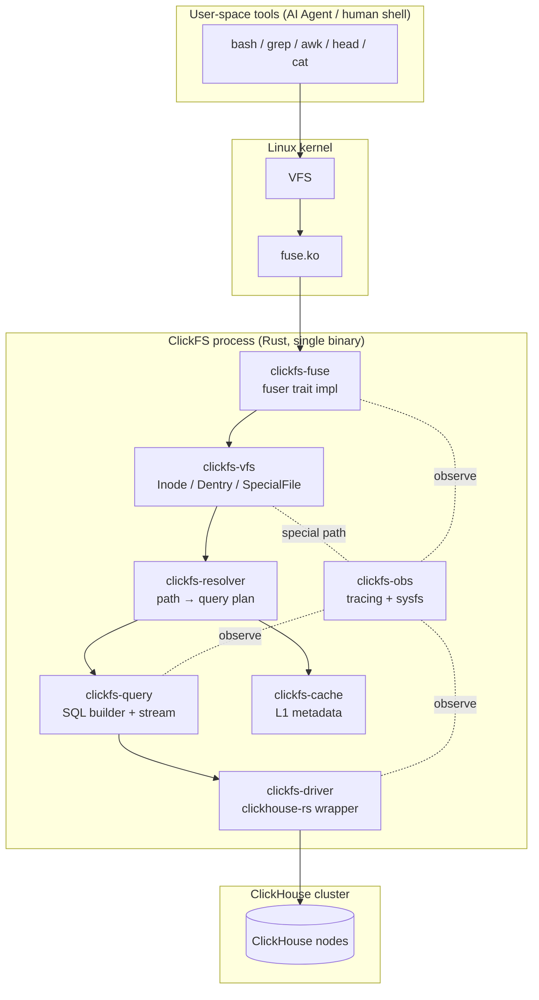
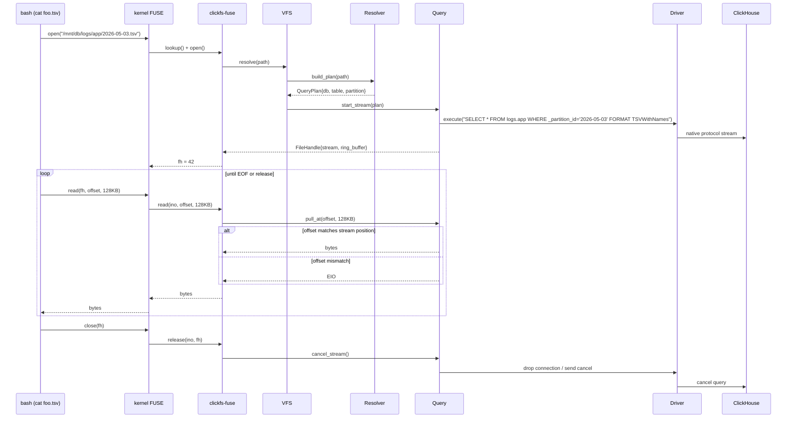
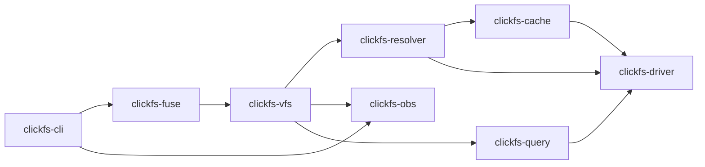
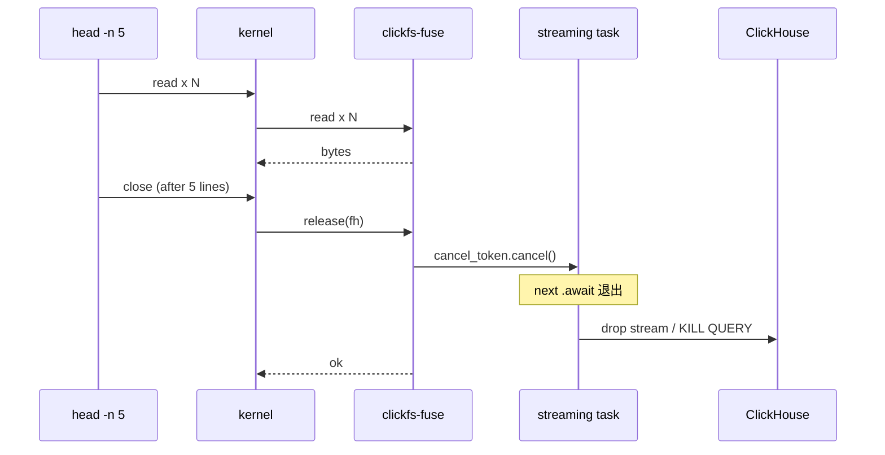

# ClickFS 架构设计文档

> 版本: v0.1-draft
> 状态: Architecture Review
> 范围: 核心架构（首轮）

---

## 文档索引

| 文件 | 内容 |
|------|------|
| [ARCHITECTURE.md](./ARCHITECTURE.md) | 主文档：项目定位、总体架构、Crate 拓扑、并发模型 |
| [path-mapping.md](./path-mapping.md) | 路径 → SQL 的映射模型（BNF + Inode 分配） |
| [streaming-read.md](./streaming-read.md) | 严格顺序流的实现细节与 FUSE 操作语义 |
| [query-construction.md](./query-construction.md) | SQL 构造规则与查询保护机制 |
| [observability.md](./observability.md) | tracing 与虚拟 sysfs 设计 |
| [traits.md](./traits.md) | 核心 trait 定义（VFS / Resolver / Driver / Cache） |

---

## 1. 概述

### 1.1 一句话描述

**ClickFS 是一个把 ClickHouse 集群以 POSIX 文件系统形式挂载到本地的 FUSE 工具，让任何 Unix 命令行工具（含 AI Agent 调用的 Shell）都能像浏览本地日志文件一样浏览 ClickHouse 数据。**

### 1.2 设计目标 (Goals)

| 目标 | 含义 | 验收标准 |
|------|------|----------|
| **G1 低门槛** | 调用方无需了解 ClickHouse SQL 即可完成探索 | `ls`/`cat`/`grep`/`head`/`awk` 默认行为符合 POSIX 直觉 |
| **G2 高吞吐** | 单文件流式读吞吐 ≥ `clickhouse-client` 的 70% | 基准：10GB 表 `cat \| wc -l` |
| **G3 可观测** | 任何一次 read 都能在 `/sys/clickfs` 路径下追溯到对应 SQL | `cat /sys/clickfs/queries` 列出所有在跑查询 |
| **G4 零侵入 CH** | 不需要在 ClickHouse 服务端安装任何插件 / UDF | 仅需一个普通 user 账号 |
| **G5 早停安全** | `head -n 5`、`grep \| head` 等场景不留下僵尸查询 | 通过黑盒测试矩阵 |

### 1.3 非目标 (Non-Goals)

- v1 **不支持任何写入**（包括 `touch`、`echo >`、`rm`），所有写操作返回 `EROFS`
- v1 **不实现真正的 `tail -f`**（ClickHouse 没有原生 streaming 订阅），如需实现，文档中说明 polling fallback 的代价
- v1 **不做查询改写优化器**（不识别 `grep` 模式并下推 `WHERE`），保持架构简单
- v1 **不实现 L2 数据缓存**（仅预留 trait），先做对再做快
- **不追求人类 SRE 的极致体验**，对齐目标是「Agent 调用零失败 + 行为可预测」
- **不替代 SQL**：定位是探索阶段的辅助层，确定性查询仍应直接走 `clickhouse-client`

### 1.4 与相邻方案的本质差异

| 方案 | 接口形态 | 学习成本 | 组合性 | 实时性 | 写入 | 备注 |
|------|----------|----------|--------|--------|------|------|
| **MCP CH server** | JSON RPC tool | 低（AI 友好） | 弱（只能调 tool） | 高 | 支持 | 当前主流，需要 AI 写 SQL |
| **chdb + REPL** | 进程内 lib | 中 | 中 | 高 | 支持 | 不接远程集群 |
| **DuckDB FUSE 视图** | 文件 | 低 | 强 | 中 | 部分 | 不是 OLAP 集群 |
| **`clickhouse-client`** | CLI | 高（需 SQL） | 强（管道） | 高 | 支持 | 老牌但门槛高 |
| **ClickFS（本方案）** | **POSIX 文件** | **极低** | **强** | **中** | **不支持(v1)** | Unix 哲学 + CH 性能 |

**核心差异化**：在所有方案中，唯一让「`ls` / `cat` / `grep` 直接对 CH 表生效」的方案。这个差异化的目标受众是**默认拥有 Shell tool 权限的 AI Agent**。

---

## 2. 系统总体架构

### 2.1 分层架构



### 2.2 Read 数据流（端到端）



### 2.3 控制流

`mount` → `init` → 持续接收 kernel 请求 → `umount`/`SIGTERM` → 优雅取消所有 streaming task → `destroy` → 进程退出。

---

## 3. 路径映射模型

详细规范见 [path-mapping.md](./path-mapping.md)。

**关键决策摘要**：

```
/db/                                数据库列表（readdir → SHOW DATABASES）
/db/<database>/                     表列表
/db/<database>/<table>/             分区列表 + 元数据文件
/db/<database>/<table>/.schema      DESCRIBE TABLE
/db/<database>/<table>/.stats       行数 / 磁盘 / 分区统计
/db/<database>/<table>/.hint        AI 友好的查询建议（静态模板生成）
/db/<database>/<table>/.explain     最近一次该表查询的执行计划
/db/<database>/<table>/<part>.tsv   分区数据流（TSVWithNames）
/db/<database>/<table>/all.tsv      无分区表 / 全表流（仅当表无 PARTITION BY 时存在）
/sys/clickfs/...                    虚拟 sysfs（见 observability.md）
```

---

## 4. Crate 拓扑

### 4.1 Workspace 结构

```
clickfs/
├── Cargo.toml                       # workspace 根
├── docs/                            # 本目录
└── crates/
    ├── clickfs-fuse/                # fuser trait impl，纯同步层
    ├── clickfs-vfs/                 # Inode/Dentry/SpecialFile 抽象
    ├── clickfs-resolver/            # path → QueryPlan
    ├── clickfs-query/               # SQL builder + 流式执行
    ├── clickfs-cache/               # L1 metadata cache（moka）
    ├── clickfs-driver/              # clickhouse crate wrapper
    ├── clickfs-obs/                 # tracing init + sysfs SpecialFile 提供方
    └── clickfs-cli/                 # bin: clickfs mount/umount
```

### 4.2 依赖图



**循环依赖防护**：所有跨 crate 的扩展点用 trait 对象 (`dyn Trait`) 暴露，避免 `clickfs-vfs` 反向依赖 `clickfs-obs`。OBS 通过实现 `vfs::SpecialFile` trait 注册到 VFS，方向永远从下层注入到上层。

### 4.3 关键依赖（Cargo）

| Crate | 用途 | 锁定版本理由 |
|-------|------|--------------|
| `fuser` = "0.14" | FUSE 同步绑定 | 最稳，社区活跃 |
| `tokio` = "1" | 异步运行时 | 多线程 + 取消传播 |
| `clickhouse` = "0.12" | ClickHouse 官方 Rust client，支持 RowBinary/TSV、native HTTP | 比 `clickhouse-rs` 维护更活跃 |
| `moka` = "0.12" | 元数据缓存 | 高并发 LRU + TTL |
| `tracing` + `tracing-subscriber` | 结构化日志 | 行业标准 |
| `bytes` = "1" | 零拷贝 buffer | 配合 ring buffer |
| `thiserror` = "1" | 错误类型 | crate 边界错误派生 |
| `parking_lot` = "0.12" | 同步锁（fuser 同步线程内使用） | 避免 std 互斥的 poisoning |
| `ahash` | path → inode 哈希 | 比默认 SipHash 快 3x |

---

## 5. 并发模型

### 5.1 fuser 同步线程 ↔ Tokio 异步桥接

`fuser` 是同步多线程模型，每个 kernel 请求会被分发到一个 worker thread 上调用 `Filesystem` trait 方法。我们的所有 IO 都是异步的（连接 ClickHouse），因此需要一个稳定的 sync ↔ async 桥。

**设计**：

- 进程启动时构建一个 **专用 multi-thread Tokio runtime**（`worker_threads = num_cpus / 2`），通过 `Arc<Runtime>` 持有
- fuser 同步方法内一律使用 `runtime.block_on(async { ... })` 或对长时操作使用 `oneshot::channel + spawn`
- **禁止** 在 fuser 同步方法里构造或销毁 runtime
- 长时间流式操作（read）走「spawn streaming task + ring buffer」模型，read 调用本身只做 `try_recv`，避免 fuser worker 被打满

```text
┌──────────────────────────┐        ┌──────────────────────────┐
│ fuser worker (sync)      │        │ Tokio runtime (async)    │
│  ┌────────────────────┐  │        │                          │
│  │ read(ino, off, sz) │──┼──pull──▶  ring buffer (per-fh)    │
│  └────────────────────┘  │        │           ▲              │
│                          │        │           │ feed         │
│                          │        │  streaming task (1 per fh)│
│                          │        │           │              │
│                          │        │           ▼              │
│                          │        │  clickhouse driver stream│
└──────────────────────────┘        └──────────────────────────┘
```

### 5.2 每个 file handle 一个 streaming task

- 在 `open()` 时 `tokio::spawn` 一个 streaming task，task 持有 `tokio::sync::CancellationToken`
- task 把 ClickHouse 流式输出的 bytes push 进一个 **bounded ring buffer**（`bytes::BytesMut` × 2，约 4MB × 2，双缓冲）
- `read()` 从 ring buffer 同步拉取；buffer 空 + 流未结束 → block 在一个 `Notify`/`Semaphore` 上（设短超时，超时返回 `EAGAIN`-translated `0` bytes，避免 hang）
- `release()` 触发 `cancel_token.cancel()`，task 在下一个 await 点退出，driver 主动发送 ClickHouse `KILL QUERY` 或直接 drop 连接

### 5.3 早停 (head -n 5) → 取消传播链路



**关键不变量**：从 `release()` 返回到 ClickHouse 端查询真正停止的延迟必须 ≤ 1s（在 `obs` 中以 P99 监控）。

### 5.4 全局并发上限与 Query Budget

- 全局 `tokio::sync::Semaphore` 限制同时进行的 ClickHouse 查询数（默认 `max(8, num_cpus)`）
- 单查询自动注入 `SETTINGS max_execution_time=60, max_result_bytes=...`（详见 [query-construction.md](./query-construction.md)）
- 触发 budget 拒绝时，`open()` 返回 `EBUSY`；AI Agent 看到的是 `cat: foo.tsv: Device or resource busy`，可重试

### 5.5 死锁与背压分析

| 场景 | 风险 | 处理 |
|------|------|------|
| ring buffer 满，task 等 reader | 若 reader 没来，task 永久阻塞 | reader 侧加 idle timeout，超时 cancel task |
| reader 等数据，task 永远不产生 | 上游 CH 慢/网络断 | streaming task 自身有 60s `max_execution_time` |
| 多个 read 并发同一 fh | POSIX 允许但语义未定义 | 用 `Mutex<StreamState>`，fh 内串行；并发只在不同 fh 之间 |
| umount 时仍有活跃 fh | `destroy()` 必须等所有 task 退出 | 全局 `JoinSet` 持有所有 task handle，`destroy()` 内 `await` 全部 |

---

## 6. 流式 Read 实现

详见 [streaming-read.md](./streaming-read.md)。要点：

- **严格顺序流状态机**：`Idle → Streaming → Drained → Closed`，offset 必须严格递增
- offset mismatch 默认返回 `EIO`；可通过挂载选项 `--allow-restart` 改为「丢弃当前流，按新 offset 重启 SELECT」
- ring buffer：双缓冲 4MB×2，`bytes::BytesMut` 实现零拷贝
- EOF 处理：上游流结束后，buffer 残留数据继续供应，最后 `read()` 返回 0 字节
- `mmap` / `splice`：**不支持**，原因是无法满足顺序流约束（kernel 可能任意 page-in）

---

## 7. SQL 构造

详见 [query-construction.md](./query-construction.md)。要点：

- 分区文件 → `SELECT * FROM <db>.<tbl> WHERE _partition_id = '<id>' FORMAT TSVWithNames`
- 全表文件 → `SELECT * FROM <db>.<tbl> FORMAT TSVWithNames`（仅无 PARTITION BY 时）
- `.schema` → `DESCRIBE TABLE <db>.<tbl> FORMAT TSVWithNames`
- `.stats` → `system.parts` / `system.tables` 聚合
- 所有查询自动追加 `SETTINGS max_execution_time, max_result_bytes, max_memory_usage`
- 标识符强制走白名单 + 反引号转义，杜绝 SQL 注入（路径里就算出现 `'; DROP` 也只会被当字符串）

---

## 8. 缓存设计

### 8.1 L1 元数据缓存（实现）

- 后端：`moka::future::Cache`
- Key 类型：`PathKey`（拥有所有权的 PathBuf）
- Value：`InodeMeta { ino, kind, size_hint, mtime, ttl_until }`
- 容量：10,000 条；TTL：30s（库/表列表）、5s（partition 列表，因 mutation 频繁）
- 失效：被动 TTL；额外有一个后台 task 每 30s 轮询 `system.parts` 比较版本号，发现差异时主动 invalidate 对应表的 entry

### 8.2 L2 数据缓存（v1 不实现）

- 仅在 `clickfs-cache` 里预留 `trait DataCache`
- 理由：流式读 + offset 严格递增的语义下，跨 open 的命中率非常低；优先做对，性能优化留到 v0.3

### 8.3 schema/stats 短 TTL 缓存

- schema：60s TTL（schema 不常变）
- stats：5s TTL（avoiding `system.parts` 风暴）

---

## 9. FUSE 操作实现细则

详见 [streaming-read.md](./streaming-read.md) 第 4 章。覆盖：

| Op | 实现要点 |
|----|----------|
| `init` | 启动 tokio runtime、连接池预热、注册 sysfs 特殊文件 |
| `lookup` | 查 L1，未命中 → resolver → 缓存写回 |
| `getattr` | 同 lookup，但只返回 attr |
| `readdir` | 三种模式：DB / Table / Partition；分页用 `offset` cookie |
| `open` | 分配 `FileHandle`，spawn streaming task（仅数据文件）；special file 直接读完整内容 |
| `read` | 从 ring buffer 拉取；offset 校验 |
| `release` | cancel token + 等 task 退出（最多 1s） |
| `statfs` | 返回伪造容量（`f_blocks = u64::MAX/2`），避免 `df` 卡死 |
| 写类操作 (`write`/`create`/`mkdir`/`unlink`/`rename`/`setattr`) | 全部返回 `EROFS` |
| `getxattr`/`listxattr` | 返回 `ENOTSUP` |

---

## 10. 错误处理

### 10.1 错误分类（`thiserror` 派生）

```text
ClickFsError
├── Connect(transport)        → ECONNREFUSED / EIO
├── Auth                      → EACCES
├── Query(ch_code, msg)       → 见映射表
├── Schema(reason)            → ENOENT / ENOTDIR
├── Protocol(io)              → EIO
├── Cancelled                 → EINTR
├── Budget(kind)              → EBUSY / EFBIG
└── ReadOrder{expected, got}  → EIO（带详细 tracing 字段）
```

### 10.2 ClickHouse 错误码 → POSIX errno 映射（节选）

| CH code | 含义 | errno | 暴露 |
|---------|------|-------|------|
| 60 (UNKNOWN_TABLE) | 表不存在 | ENOENT | lookup/open |
| 81 (UNKNOWN_DATABASE) | 库不存在 | ENOENT | lookup |
| 159 (TIMEOUT_EXCEEDED) | 查询超时 | ETIMEDOUT | read/open |
| 241 (MEMORY_LIMIT_EXCEEDED) | 内存超限 | ENOMEM | read |
| 394 (QUERY_WAS_CANCELLED) | 主动取消 | EINTR | release 后果 |
| 其他 | 默认 | EIO | 始终写 sysfs errors |

### 10.3 错误暴露增强

除返回 errno 外，**所有错误都会同步写入 `/sys/clickfs/errors`**（环形 100 条），AI Agent 可以在看到 `Input/output error` 后立即 `cat /sys/clickfs/errors | tail -n 1` 看到根因 SQL。这是相比 MCP 方案的关键体验优势：errno 不丢人话。

### 10.4 Panic 隔离

- streaming task 用 `tokio::spawn` 裸跑会丢 panic → 用 `JoinSet`，task 结束在中央调度器上 `await`，发现 panic → 写 sysfs errors + 标记 fh 为 `Failed`
- fuser worker 内禁用 panic (`panic = "abort"` 仅 release，debug 用 unwind 抓栈)

---

## 11. 可观测性

详见 [observability.md](./observability.md)。要点：

- tracing span 三层：`fuse_op` → `query` → `driver`
- EnvFilter 默认 `clickfs=info,fuser=warn`
- 虚拟 sysfs 路径见 [path-mapping.md](./path-mapping.md) §3.2 中的 `/sys/clickfs/...` 部分

---

## 12. 配置与 CLI

### 12.1 命令行

```text
clickfs mount <ch_url> <mountpoint> [flags]

flags:
  --config <path>         TOML 配置文件
  --readonly              强制只读（v1 默认即只读，预留以兼容未来）
  --foreground / -f       不 daemonize
  --allow-other           对其他用户可见（默认禁用）
  --max-concurrent <N>    全局并发上限
  --query-timeout <s>     默认 60
  --max-result-bytes <B>  默认 1 GiB
  --log <level>           覆盖 RUST_LOG

clickfs umount <mountpoint>
clickfs status <mountpoint>     # 等价于 cat <mp>/sys/clickfs/stats
```

### 12.2 配置文件 schema（TOML 节选）

```toml
[clickhouse]
url = "https://ch.example.com:8443"
user = "clickfs"
password_env = "CLICKFS_PASSWORD"   # 从环境变量读，避免文件泄露
database = "default"                # 缺省 db（影响 SHOW 行为）
secure = true

[mount]
allow_other = false
default_permissions = true

[limits]
max_concurrent = 8
query_timeout_secs = 60
max_result_bytes = 1073741824
ring_buffer_bytes = 4194304
ring_buffer_count = 2

[cache]
meta_capacity = 10000
meta_ttl_secs = 30
partition_ttl_secs = 5
schema_ttl_secs = 60

[obs]
log_level = "info"
sysfs_errors_capacity = 100
```

### 12.3 信号处理

- `SIGTERM` / `SIGINT`：触发 graceful shutdown → 取消所有 streaming task → 等 ≤5s → fuser unmount → 进程退出
- `SIGHUP`：重新加载 `[obs]` 配置（log level hot reload）
- 进程异常退出 → 系统 `fusermount -u` 清理（CLI 子命令 `clickfs umount` 提供 wrapper）

---

## 13–15. TODO

> 以下章节首轮文档不展开，后续补全。

- **§13 测试策略**：单元 + testcontainers 集成 + bash 黑盒矩阵 + path resolver fuzz
- **§14 平台与限制**：Linux libfuse3 主推；macOS macFUSE 兼容性差异
- **§15 路线图**：v0.1 / v0.2 / v0.3 / v0.4 / v1.0 节奏

---

## 16. 开放问题

| # | 问题 | 备选方案 | 当前倾向 |
|---|------|----------|----------|
| Q1 | 数据文件 `getattr().size` 返回什么？ | (a) `i64::MAX` (b) `system.parts` 估算 (c) 0 | **(b) 估算**，命中 stats 缓存，仅在偏离实际 ±20% 时刷新 |
| Q2 | offset mismatch 时是否支持重启流？ | (a) 永远 EIO (b) `--allow-restart` 全局开关 (c) 自定义 `O_*` flag | **(b)** 简单可控，避免 fcntl 兼容性问题 |
| Q3 | `.hint` 由谁生成？ | (a) 静态 schema 模板 (b) 调用本地 LLM | **(a)** v1，避免引入 LLM 依赖 |
| Q4 | 是否记录全量查询审计日志？ | (a) 否 (b) `~/.clickfs/history.sqlite` | 默认 (a)，配置开启 (b) |
| Q5 | 是否支持多 CH 集群挂载到一个 mount point？ | (a) 一对一 (b) 顶层 `/cluster_a/db/...`、`/cluster_b/db/...` | v1 选 **(a)**；v0.3 评估 (b) |

---

## 附录索引

- 附录 A. Cargo workspace 完整骨架 — *TODO*
- 附录 B. 核心 trait 定义 — 见 [traits.md](./traits.md)
- 附录 C. 数据结构 ER 图 — *TODO*
- 附录 D. mount → 第一个 cat 的完整时序图 — 见 §2.2
- 附录 E. 与 MCP CH server 的功能对照表 — 见 §1.4
- 附录 F. 参考资料 — *TODO*
