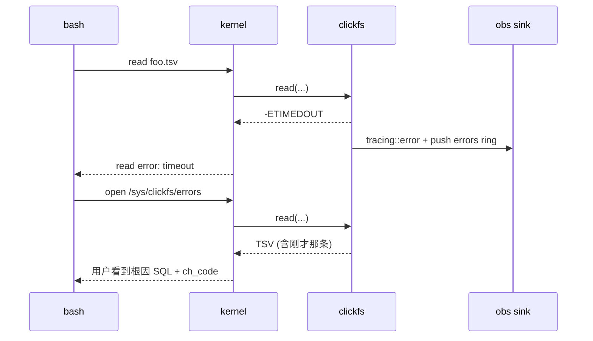

# 可观测性 (observability)

> 隶属：[ARCHITECTURE.md §11](./ARCHITECTURE.md)
> 范围：tracing 设计、虚拟 sysfs 路径、日志/指标暴露策略

---

## 1. 设计原则

1. **errno 不丢人话**：任何 `EIO`/`EBUSY` 必须能在 `/sys/clickfs/...` 下找到对应的可读解释
2. **零额外端口**：v1 不开 HTTP 端口；所有可观测信息走文件系统本身（mount 已经暴露）
3. **自描述**：`cat /sys/clickfs/help` 列出全部可观测路径，AI 不需要外部文档
4. **低开销**：观测路径本身的 read 不应触发额外 ClickHouse 查询

## 2. tracing 设计

### 2.1 Span 层级

```text
fuse_op{op, ino, fh}
  └── resolve{path}
  └── cache_lookup{key, hit}
  └── query{query_id, db, table, plan_kind}
        └── driver{protocol, host}
              └── stream_chunk{seq, bytes}
```

### 2.2 Field 规范

每个 span 必须携带的字段：

| 字段 | 类型 | 来源 |
|------|------|------|
| `query_id` | UUID | ClickFS 内部 fh id 或 query uuid |
| `path` | str | 用户可见路径 |
| `op` | enum | lookup/getattr/readdir/open/read/release/... |
| `errno` | i32 | 仅出错时 |
| `ch_code` | i32 | 仅 ClickHouse 错误时 |
| `bytes` | u64 | read/stream 累积字节数 |

### 2.3 EnvFilter 默认值与热重载

```text
默认: clickfs=info,clickfs::sql=debug,fuser=warn
通过 SIGHUP 重新加载 [obs].log_level
```

热重载实现：`tracing-subscriber` 的 `reload::Layer<EnvFilter>` + 信号处理器。

### 2.4 输出后端

| 模式 | 后端 | 启用方式 |
|------|------|----------|
| 默认 | stderr 行式 (`fmt::Layer`) | 总是 |
| JSON | `fmt::layer().json()` | `--log-format json` |
| 文件 | rolling file appender | `--log-file <path>` |
| OTLP | `tracing-opentelemetry` | v0.3 引入，v1 不做 |

## 3. 虚拟 sysfs 路径

所有 `/sys/clickfs/*` 路径都是 special file，由 `clickfs-obs` 注册到 VFS 的 `SpecialFile` registry。

### 3.1 路径表

| 路径 | 类型 | 内容 |
|------|------|------|
| `/sys/clickfs/version` | file | 构建版本 + git sha + 编译时间 |
| `/sys/clickfs/config` | file | 当前生效配置（脱敏 password） |
| `/sys/clickfs/stats` | file | 全局统计（见 §3.2） |
| `/sys/clickfs/queries` | dir | 当前在跑的 query 列表 |
| `/sys/clickfs/queries/<id>` | file | 单 query 详情（见 §3.3） |
| `/sys/clickfs/cache` | file | 缓存命中率与容量 |
| `/sys/clickfs/errors` | file | 最近 100 条错误（环形） |
| `/sys/clickfs/help` | file | 自描述：列出全部观测路径 + 简短说明 |

### 3.2 `/sys/clickfs/stats` 输出格式

TSV，单段 key-value：

```text
key                          value
uptime_secs                  3712
clickhouse_url               https://ch.example.com:8443
active_handles               3
total_handles_opened         1421
total_bytes_read             8923748234
total_queries_issued         1432
total_queries_failed         11
queries_in_flight            2
cache_meta_entries           812
cache_meta_hit_ratio         0.9612
ring_buffer_bytes            8388608
```

### 3.3 `/sys/clickfs/queries` 与 `/sys/clickfs/queries/<id>`

`readdir` 返回当前活跃 query 的 id 列表（命名 `<id>`）。
`cat /sys/clickfs/queries` 直接拼接成表格输出（同时是 dir，又能 cat —— 实现方式：dir 自身有 `__list.tsv` ？不优雅；改为 `/sys/clickfs/queries` 是**file**，`/sys/clickfs/queries.d/<id>` 是**dir 内文件**，避免 dir+file 同名冲突）。

修订后路径：

| 路径 | 类型 | 说明 |
|------|------|------|
| `/sys/clickfs/queries` | file | TSV 总表 |
| `/sys/clickfs/queries.d/` | dir | 每条 query 一个文件 |
| `/sys/clickfs/queries.d/<id>` | file | 单 query 详情（kv 形式） |

### 3.4 `/sys/clickfs/cache`

```text
cache                  entries  capacity  hit       miss      hit_ratio
meta:db:list           1        1         413       2         0.9952
meta:tables:logs       1        100       102       8         0.9273
meta:parts:logs.app    1        10000     2841      31        0.9892
meta:schema:*          12       10000     1532      14        0.9909
inode:*                812      100000    -         -         -
```

### 3.5 `/sys/clickfs/errors`

环形 100 条，每条一行 TSV：

```text
ts                       errno  ch_code  path                                 op    msg
2026-05-03T10:14:11.221Z 5      159      /db/logs/app_prod/2026-05-03.tsv     read  query timeout exceeded (60s)
2026-05-03T10:11:02.001Z 2      60       /db/logs/missing/.schema             open  table missing not found
```

### 3.6 `/sys/clickfs/help`

静态文本，列出上述全部路径与一句话用途。AI 第一次进入 mount 后建议执行：
```bash
cat /sys/clickfs/help
```

## 4. errno → 可观测信息追溯流程



## 5. 指标对照表（未来 Prometheus，v0.3）

为后续 Prometheus exporter 预留命名规范：

| 指标 | 类型 | label | 说明 |
|------|------|-------|------|
| `clickfs_handles_active` | gauge | - | 活跃 fh 数 |
| `clickfs_bytes_read_total` | counter | path_prefix | 累计读字节 |
| `clickfs_query_duration_seconds` | histogram | plan_kind, status | 查询耗时 |
| `clickfs_query_errors_total` | counter | ch_code | 错误计数 |
| `clickfs_cache_hits_total` | counter | cache | 命中 |
| `clickfs_cache_misses_total` | counter | cache | 未命中 |
| `clickfs_ring_buffer_wait_seconds` | histogram | - | reader 等数据时长 |
| `clickfs_cancel_latency_seconds` | histogram | - | release → CH stop 延迟 |

v1 这些指标只走 tracing；v0.3 引入 `metrics` crate 桥接。

## 6. 故障排查 Cookbook（给 AI 的）

`/sys/clickfs/help` 内容会嵌入以下片段：

```text
# 问题 → 排查路径

read 报 EIO:
    cat /sys/clickfs/errors | tail -n 5

read 报 EBUSY:
    cat /sys/clickfs/stats | grep queries_in_flight
    （达到 max_concurrent 时发生，等其他查询完成或调大 --max-concurrent）

cat 卡很久无输出:
    ls /sys/clickfs/queries.d/      # 查看在跑的查询
    cat /sys/clickfs/queries.d/<id> # 看具体 SQL 与已传字节

ls 一个表目录很慢:
    可能是首次访问，触发 system.parts 查询
    第二次访问会命中 5s TTL 缓存

cat /db/foo/bar/.stats 很大:
    bytes_on_disk 是压缩后大小，cat 数据文件输出是解压后 TSV，可能 5-10x

突然 ENOENT:
    cat /sys/clickfs/errors | grep <path>
    可能 ClickHouse 端 DROP 了表，缓存最迟 30s 内同步
```

## 7. 隐私与安全

- `/sys/clickfs/config` 输出时 password 字段固定显示 `***`
- `/sys/clickfs/queries.d/<id>` 中的 SQL 不脱敏（用户已认证）；如需脱敏 → v0.3 加 `--mask-literals`
- `/sys/clickfs/errors` 不包含完整 SQL，仅截断到 256 字符
- 默认所有 sysfs 文件 mode = `0400`（仅挂载用户可读）
