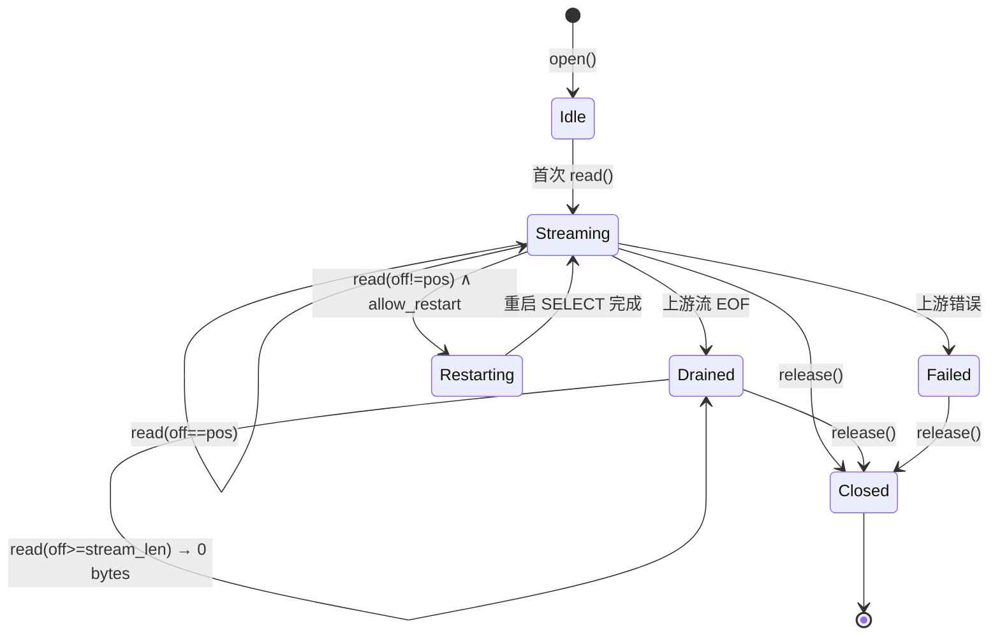

# 流式 Read 与 FUSE 操作语义

> 隶属：[ARCHITECTURE.md §6 §9](./ARCHITECTURE.md)
> 范围：严格顺序流状态机、ring buffer、FUSE 操作的具体语义

---

## 1. 严格顺序流状态机

数据文件 (`<part>.tsv` / `all.tsv`) 的 file handle 在生命周期内严格遵循以下状态机：



### 1.1 状态字段

```text
struct StreamState {
    plan:         QueryPlan,
    cancel:       CancellationToken,
    join:         JoinHandle<Result<(), QueryError>>,
    ring:         RingBuffer,            // 见 §2
    stream_pos:   u64,                   // 已经成功 read() 给 kernel 的字节数
    upstream_done:bool,                  // 上游流是否结束
    last_err:     Option<QueryError>,
    state:        Phase,                 // Idle / Streaming / Drained / Failed / Restarting / Closed
}
```

### 1.2 状态转移规则

| 当前状态 | 事件 | 动作 | 新状态 |
|----------|------|------|--------|
| Idle | 首次 `read(off=0)` | spawn task；从 ring 拉取 | Streaming |
| Idle | 首次 `read(off!=0)` 且 `allow_restart=false` | 返回 EIO | Idle |
| Idle | 首次 `read(off!=0)` 且 `allow_restart=true` | 等价于 Restarting | Restarting |
| Streaming | `read(off=stream_pos, n)` | ring.pull(n) → kernel；`stream_pos += n` | Streaming |
| Streaming | `read(off=stream_pos, n)`，ring 为空且 task 活 | 等 Notify（最多 100ms）；超时返回 0（但实际 0 仅用于 EOF，所以重试） | Streaming |
| Streaming | `read(off<stream_pos)` | 返回 EIO（已丢失） | Streaming |
| Streaming | `read(off>stream_pos)` 且 `allow_restart=false` | 返回 EIO | Streaming |
| Streaming | `read(off>stream_pos)` 且 `allow_restart=true` | cancel 当前 task；spawn 新 task 带 `OFFSET` 不可行 → 重新 SELECT 并丢弃 `off` 字节 | Restarting |
| Streaming | task 报告 EOF | 标记 `upstream_done=true` | Drained |
| Streaming | task 报告错误 | 写 sysfs/errors；保留 `last_err` | Failed |
| Drained | `read(off=stream_pos)`，ring 有残留 | 拉残留 | Drained |
| Drained | ring 空 | 返回 0 字节 | Drained |
| Failed | `read(*)` | 返回映射后的 errno | Failed |
| 任意 | `release()` | `cancel.cancel()`；`join.await timeout 1s`；释放 ring | Closed |

### 1.3 `--allow-restart` 的含义与代价

- 默认 `false`：严格顺序流。任何 offset mismatch → `EIO`。
- 开启 `true`：允许 kernel readahead / `dd skip=...` 等场景。**代价**：每次 mismatch 都重启 ClickHouse 查询并丢弃前 `off` 字节，性能极差。仅推荐在交互式调试场景临时开启。

## 2. Ring Buffer 设计

### 2.1 结构

- 双缓冲：`[BytesMut; 2]`，每片默认 4 MiB，可配
- 写入 task 持有「写半段」指针，read 端持有「读半段」指针
- 一次切换由一个 `tokio::sync::Notify` 触发

```text
+------------+------------+
| chunk[0]   | chunk[1]   |
| (writer)   | (reader)   |
+------------+------------+
        ↑ swap on full
```

### 2.2 不变量

- 写满当前 chunk → 等 reader 把另一 chunk 读空 → swap → 继续写
- read 端永远从 `reader_chunk` 拉；拉空 → 检查 `upstream_done`：
  - true → 返回 0
  - false → `Notify.notified().await`
- 取消传播：`Notify` wait 必须用 `tokio::select!` 包 `cancel_token.cancelled()`

### 2.3 为什么不用 `tokio::sync::mpsc<Bytes>`

- channel 的 backpressure 粒度是「条」，对字节流不友好
- 双 chunk swap 拷贝次数最少（实际是零拷贝，只移动 `BytesMut`）
- read 路径无 alloc

## 3. EOF / Partial Read 语义

| 场景 | POSIX 行为 | ClickFS 行为 |
|------|-----------|--------------|
| `read(n)` 返回 `< n` | 允许，调用方应循环 | 我们尽量返回 `n`；流末尾返回 `< n` 然后下次返回 0 |
| `read()` 返回 0 | EOF | 仅当 `upstream_done && ring empty` |
| `read()` 在数据未到时 | 阻塞 | 我们最多等 100 ms；超时返回 `EAGAIN`-translated 行为：实际**继续等**直到 ring 有数据或 EOF（不向 kernel 返回 0，避免误判 EOF） |

> POSIX 不允许「短读不是 EOF」的歧义，因此我们坚决不在中途返回 0。

## 4. FUSE 操作完整实现表

### 4.1 `init`

```text
- 启动 tokio runtime（worker_threads = max(2, num_cpus / 2)）
- 建立 ClickHouse 连接池（min=2, max=max_concurrent）
- 预热：SELECT 1
- 注册 SysfsRegistry 到 VFS
- 加载配置中的 cache 容量、TTL
```

### 4.2 `lookup(parent_ino, name)`

```text
parent_path = inode_table.lookup(parent_ino)?
child_path  = parent_path.join(name)
plan        = resolver::resolve(&child_path)?
meta        = cache.get_or_query(plan).await?
ino         = inode_table.allocate(&child_path)
reply.entry(meta.to_attr(ino), ttl)
```

### 4.3 `getattr(ino)`

`lookup` 路径的简化版；只命中 inode_table + cache。

### 4.4 `readdir(ino, offset, reply)`

三种 dir 类型：

| Dir | 子项来源 | 排序 |
|-----|---------|------|
| `/db` | `system.databases` | 字典序 |
| `/db/<db>` | `system.tables` | 字典序 |
| `/db/<db>/<tbl>` | `system.parts` DISTINCT partition_id + 4 个 dotfile | 分区字典序，dotfile 在前 |

实现要点：
- `offset` 是 cookie，我们直接用「行序号 + 1」
- 每次 readdir 重新查列表（命中缓存），保证视图一致
- 单次 readdir 全量返回（条目数小，分区数极端情况下也不会上百万；如超 10k 引入分页）

### 4.5 `open(ino, flags)`

```text
plan = resolver::resolve(path_of(ino))?
match plan.kind:
    Stream*       => 
        global_sem.try_acquire()? else EBUSY
        state = StreamState::new(plan, cancel)
        spawn streaming task with cancel
        fh = file_table.insert(state)
        reply.opened(fh, FOPEN_DIRECT_IO)   // 关闭 kernel page cache
    DescribeTable | TableStats | StaticHint | LastExplain | Sys(*) =>
        bytes = special_file::render(plan).await?
        fh = file_table.insert(SpecialState{ bytes, pos: 0 })
        reply.opened(fh, 0)                 // 允许 kernel cache
    其他            => EISDIR
```

**`FOPEN_DIRECT_IO`**：对数据文件强制开启，避免 kernel page cache 缓存大日志的过期数据；对 special file 不开启，让 `cat .schema` 的小内容利用 cache。

### 4.6 `read(ino, fh, offset, size)`

```text
state = file_table.get(fh)?
match state:
    Stream(s)  => stream_read(s, offset, size).await
    Special(s) => special_read(s, offset, size)
```

**`stream_read`** 严格按状态机表驱动；**`special_read`** 是一次拷贝。

### 4.7 `release(ino, fh)`

```text
state = file_table.remove(fh)?
match state:
    Stream(s) =>
        s.cancel.cancel()
        timeout(1s, s.join).await    // 即使超时也强制丢弃
        global_sem.release()
    Special(_) => 直接 drop
```

### 4.8 `statfs`

```text
返回:
    f_bsize    = 4096
    f_blocks   = u64::MAX / 2
    f_bfree    = u64::MAX / 4
    f_bavail   = u64::MAX / 4
    f_files    = inode_table.len() * 1000
    f_ffree    = u64::MAX / 4
    f_namemax  = 255
```

避免 `df -h` 卡死或显示 0%。

### 4.9 写类操作

| Op | 返回 |
|----|------|
| `setattr` (含 truncate, chmod, chown, utimens) | `EROFS` |
| `mknod`, `mkdir`, `unlink`, `rmdir`, `symlink`, `rename`, `link` | `EROFS` |
| `create` (open with `O_CREAT`) | `EROFS` |
| `write`, `flush`, `fsync`, `fallocate` | `EROFS` |

> `flush` 严格说不算写，但 v1 也返回 `EROFS` 以确保 `vim` 等编辑器立即报错而不是以为成功。

### 4.10 扩展属性 / ACL

`getxattr` / `setxattr` / `listxattr` / `removexattr` → `ENOTSUP`。

## 5. 与 mmap / splice 的兼容性

| 系统调用 | 支持 | 原因 |
|----------|------|------|
| `mmap(MAP_PRIVATE)` | ❌（kernel 会对数据文件 deny） | 需要随机访问 + 全文件 size 已知，与流式语义冲突 |
| `mmap(MAP_SHARED)` | ❌ | 同上 + 需要写支持 |
| `splice` | ⚠️ 退化为 `read` | fuser 不直接支持 splice |
| `sendfile` | ⚠️ 同上 | |
| `O_DIRECT` | ✅ 已默认启用 | |

**实现**：`getattr` 返回的 size 已经是 stats 估算值；若 kernel 仍尝试 mmap，我们在 `read` 中检测到 offset 跳跃即按状态机规则处理（默认 `EIO`）。

## 6. 特殊场景处理

### 6.1 `head -n 5` 早停

详见 [ARCHITECTURE.md §5.3](./ARCHITECTURE.md)。关键 SLO：从 `release()` 到 ClickHouse 端查询真正停止 ≤ 1s。

### 6.2 `cat > /dev/null` 全量读

走正常 streaming，无早停；性能基线场景。

### 6.3 `tail file.tsv`

`tail` 默认读末尾 10 行，会先 `seek(end - 8KB)` 然后读。
- 若 `allow_restart=false`：第一次 `read(offset>0)` → `EIO`；用户看到 `tail: ... Input/output error`
- 若 `allow_restart=true`：触发重启流并丢弃前 `offset` 字节，对大文件极慢
- **官方推荐**：用 `head` 或显式 `cat` + `awk 'END{...}'`；或挂载时启用 `--allow-restart` 接受性能代价

### 6.4 `tail -f` 流式跟随

v1 **不支持**，`open()` 即 streaming SELECT，无 follow 语义。
未来如果实现，方案是引入 `/db/<db>/<tbl>/.follow.tsv` 特殊文件，read 时持续轮询 `WHERE _timestamp > <last_ts>`，但要面对：
- CH 不擅长高 QPS 短查询
- `_timestamp` 列假设可能不存在
- 无 exactly-once 语义

### 6.5 `cp file.tsv /tmp/`

正常顺序 read，无问题。`cp` 会调用 `fadvise(SEQUENTIAL)`，正中下怀。

### 6.6 `grep PATTERN | head -n 5`

`grep` 顺序读 → 命中 5 个匹配后 `head` 关闭 stdin → `grep` 触发 SIGPIPE → `grep` 关闭文件 → `release` → cancel CH 查询。**完美早停**。

## 7. 错误注入测试矩阵（黑盒）

| 命令 | 预期结果 |
|------|----------|
| `cat <part>.tsv \| wc -l` | 行数 = `SELECT count() FROM ... WHERE _partition_id=...`（含 header 行 +1） |
| `head -c 1024 <part>.tsv` | 1024 字节，1s 内 CH 端查询消失 |
| `tail <part>.tsv` | EIO（默认） |
| `dd if=<part>.tsv bs=1M count=10` | 10 MiB |
| `dd if=<part>.tsv bs=1M skip=5 count=1` | EIO（默认）/ 1 MiB（restart） |
| `cp <part>.tsv /tmp/x` | 字节数与 `.stats.bytes_on_disk` 量级一致 |
| `vim <part>.tsv` | 失败（writeable 检测 EROFS） |
| `echo x > <part>.tsv` | EROFS |
| `rm <part>.tsv` | EROFS |
| `ls -la` | 正常列出，dotfile 在前 |
| `df -h` | 正常返回伪造容量，不卡 |
| `find /mnt/clickfs/db -name '*.tsv'` | 列出所有分区文件，**注意**：会触发对每张表的 ListPartitions，可能很慢 |
